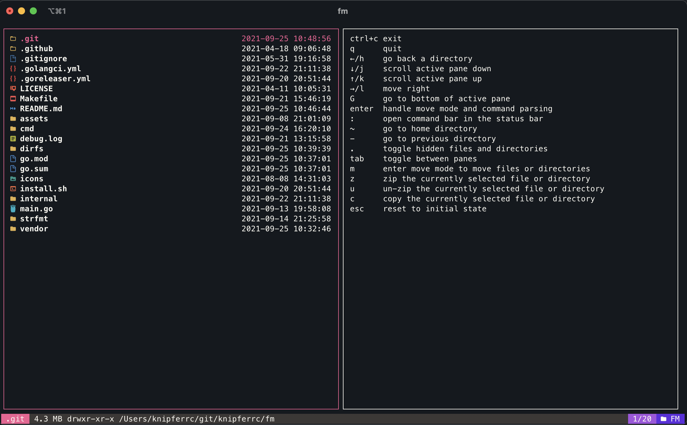
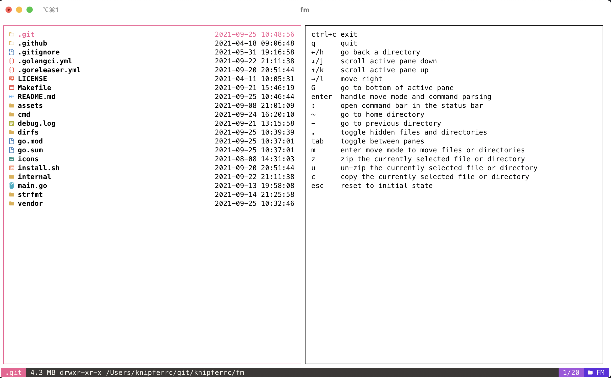
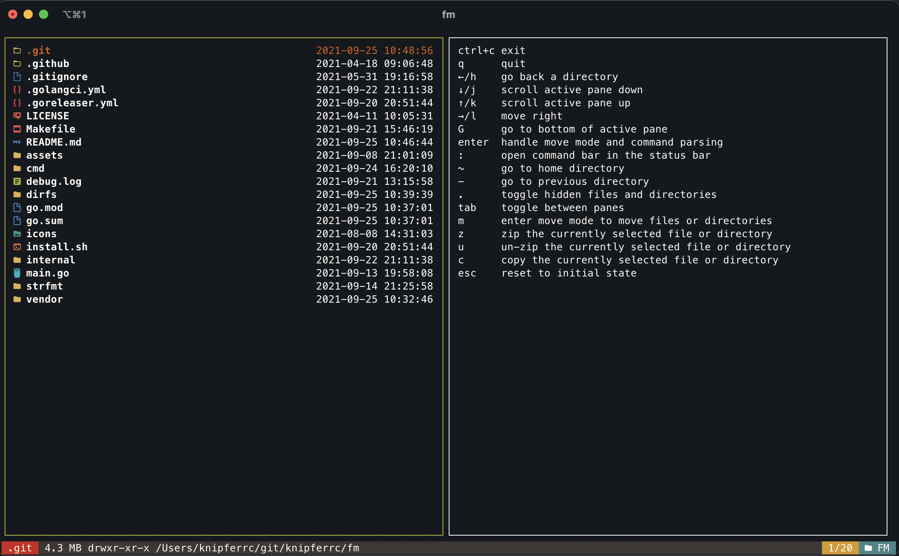
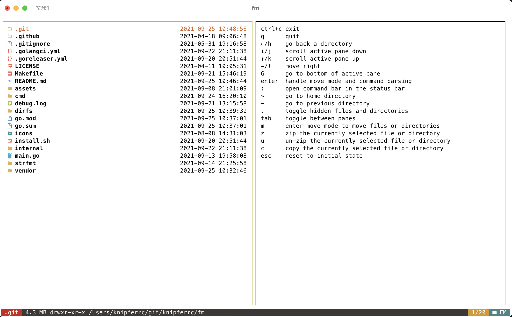
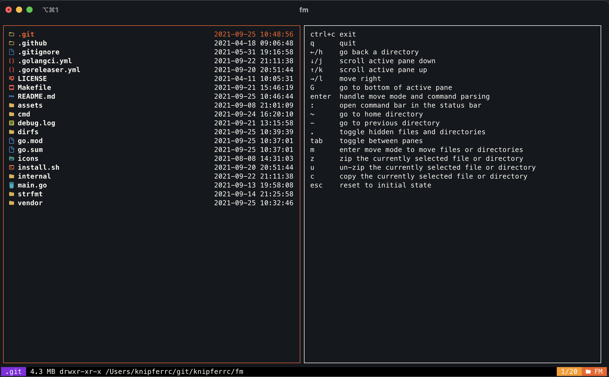
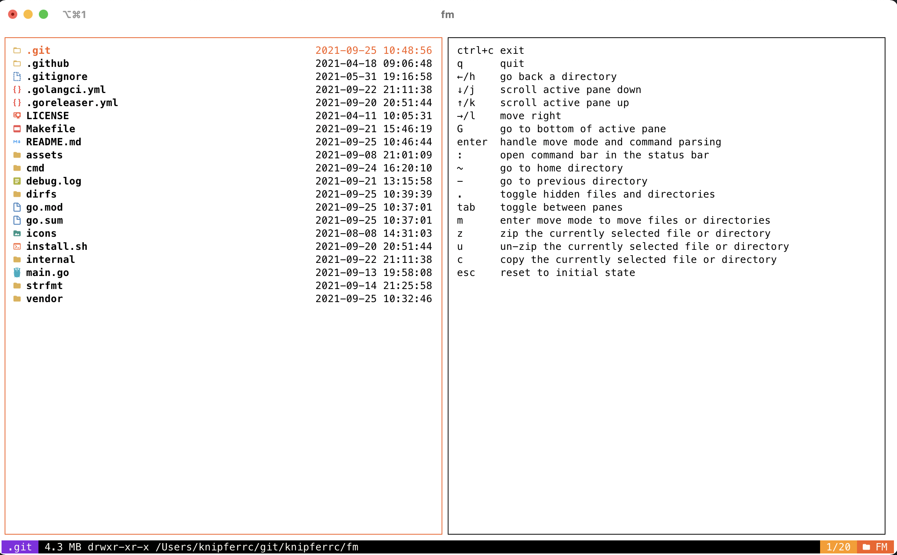

<p align="center">
  
  <p align="center">
    Keep those files organized
  </p>
  <p align="center">
    <a href="https://github.com/knipferrc/fm/releases"></a>
    <a href="https://pkg.go.dev/github.com/knipferrc/fm?tab=doc"></a>
    <a href="https://github.com/knipferrc/fm/actions"></a>
  </p>
</p>

<p align="center" style="margin-top: 30px; margin-bottom: 20px;">
  
</p>

## About The Project

A terminal based file manager

### Built With

- [Go](https://golang.org/)
- [bubbletea](https://github.com/charmbracelet/bubbletea)
- [bubbles](https://github.com/charmbracelet/bubbles)
- [lipgloss](https://github.com/charmbracelet/lipgloss)
- [Glamour](https://github.com/charmbracelet/glamour)
- [Chroma](https://github.com/alecthomas/chroma)
- [Viper](https://github.com/spf13/viper)
- [Cobra](https://github.com/spf13/cobra)

## Installation

### Curl

```sh
curl -sfL https://raw.githubusercontent.com/knipferrc/fm/main/install.sh | sh
```

### Go

```
go install github.com/knipferrc/fm@latest
```

## Features

- Double pane layout
- File icons
- Layout adjusts to terminal resize
- Syntax highlighting for source code
- Render pretty markdown
- Mouse support
- Themes (default, gruvbox, spooky)
- Render PNG, JPG and JPEG as strings
- Colors adapt to terminal background

## Themes

### Default




### Gruvbox




### Spooky




## Usage

- Run `fm` or `fm /some/dir`

## Navigation

| Key                  | Description                                                                                                                                                                                                                                                      |
| -------------------- | ---------------------------------------------------------------------------------------------------------------------------------------------------------------------------------------------------------------------------------------------------------------- |
| h or left            | Go back to previous directory                                                                                                                                                                                                                                    |
| j or down            | Move down in the file tree or scroll pane down                                                                                                                                                                                                                   |
| k or up              | Move up in the file tree or scroll pane up                                                                                                                                                                                                                       |
| l or right           | Opens the currently selected directory or file                                                                                                                                                                                                                   |
| gg                   | Jump to bottom of file tree or pane                                                                                                                                                                                                                              |
| G                    | Jump to top of file tree or pane                                                                                                                                                                                                                                 |
| ~                    | Go to home directory                                                                                                                                                                                                                                             |
| .                    | Toggle hidden files and directories                                                                                                                                                                                                                              |
| -                    | Go to previous directory                                                                                                                                                                                                                                         |
| ctrl+c               | Exit                                                                                                                                                                                                                                                             |
| q                    | Exit if command bar is not open                                                                                                                                                                                                                                  |
| m                    | Move the currently selected file or directory. Once pressed, the file manager enters move mode. Navigate the tree as usual and press enter in the desired destination directory. It will navigate back to the starting direcotry in which the move was initiated |
| :                    | Open command bar                                                                                                                                                                                                                                                 |
| mkdir dirname        | Create a new directory in the current directory                                                                                                                                                                                                                  |
| touch filename.txt   | Create a new file in the current directory                                                                                                                                                                                                                       |
| rename or mv newname | Rename currently selected file or directory                                                                                                                                                                                                                      |
| delete or rm         | Delete the currently selected file or directory                                                                                                                                                                                                                  |
| tab                  | Toggle between panes                                                                                                                                                                                                                                             |
| esc                  | Cancel any current action. Pressing escape during any action (rename, move, delete) will cancel that operation and return back to file navigation                                                                                                                |
| z                    | Create a zip file of the currently selected directory item                                                                                                                                                                                                       |
| u                    | Unzip a zip file                                                                                                                                                                                                                                                 |
| c                    | Create a copy of a file or directory                                                                                                                                                                                                                             |

## Configuration

- A config file will be generated at `~/.fm.yml` when you first run `fm`

```yml
settings:
  borderless: false
  enable_logging: false
  enable_mousewheel: true
  pretty_markdown: true
  show_icons: true
  start_dir: .
  theme: default
```

## Local Development

Follow the instructions below to get setup for local development

1. Clone the repo

```sh
git clone https://github.com/knipferrc/fm
```

2. Run

```sh
make
```

3. Build a binary

```sh
make build
```

## Credit

- Thank you to this repo https://github.com/Yash-Handa/logo-ls for the icons
