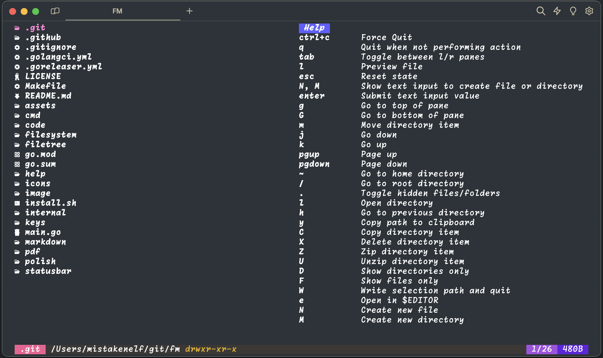
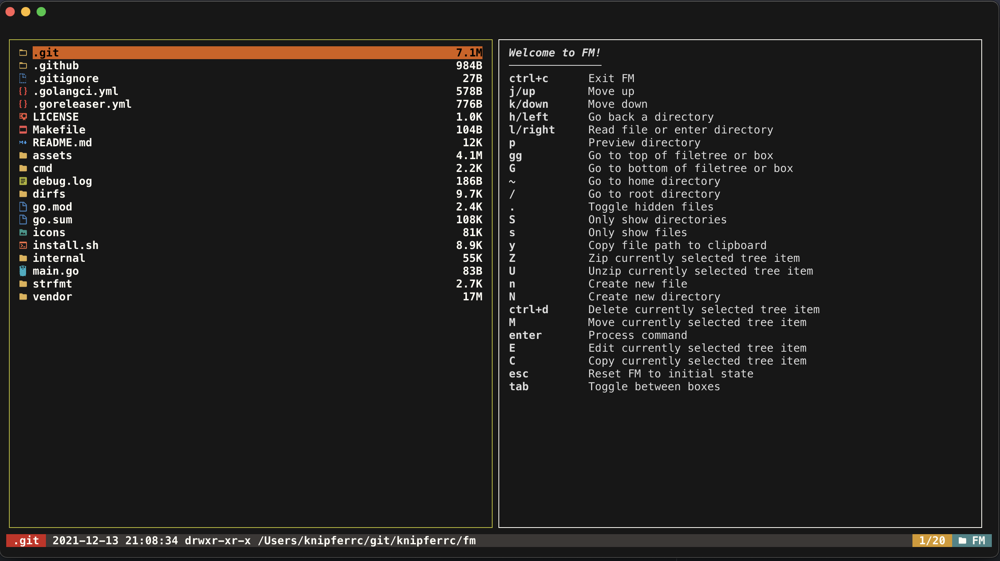
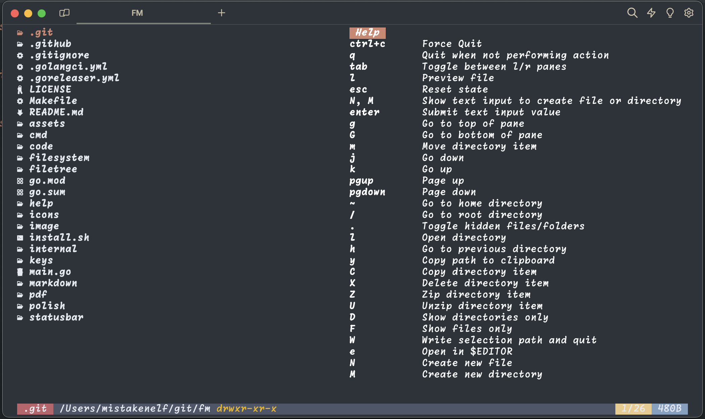

<p align="center">
  
  <p align="center">
    Keep those files organized
  </p>
  <p align="center">
    <a href="https://github.com/mistakenelf/fm/releases"></a>
    <a href="https://pkg.go.dev/github.com/mistakenelf/fm?tab=doc"></a>
    <a href="https://github.com/mistakenelf/fm/actions"></a>
  </p>
</p>

<p align="center" style="margin-top: 30px; margin-bottom: 20px;">
  
</p>

## About The Project

A terminal based file manager

### Built With

- [Go](https://golang.org/)
- [bubbletea](https://github.com/charmbracelet/bubbletea)
- [bubbles](https://github.com/charmbracelet/bubbles)
- [lipgloss](https://github.com/charmbracelet/lipgloss)
- [Glamour](https://github.com/charmbracelet/glamour)
- [Chroma](https://github.com/alecthomas/chroma)
- [Cobra](https://github.com/spf13/cobra)

## Installation

### Curl

```sh
curl -sfL https://raw.githubusercontent.com/mistakenelf/fm/main/install.sh | sh
```

### Go

```
go install github.com/mistakenelf/fm@latest
```

### AUR

Install through the Arch User Repository with your favorite AUR helper.
There are currently two possible packages:

- [fm-git](https://aur.archlinux.org/packages/fm-git/): Builds the package from the main branch

```sh
paru -S fm-git
```

- [fm-bin](https://aur.archlinux.org/packages/fm-bin/): Uses the github release package

```sh
paru -S fm-bin
```

## Features

- File icons (requires nerd font)
- Layout adjusts to terminal resize
- Syntax highlighting for source code with customizable themes using styles from [chroma](https://swapoff.org/chroma/playground/) (dracula, monokai etc.)
- Render pretty markdown
- Mouse support
- Themes (`default`, `gruvbox`, `nord`)
- Render PNG, JPG and JPEG as strings
- Colors adapt to terminal background, for syntax highlighting to work properly on light/dark terminals, set the appropriate themes in the config file
- Open selected file in editor set in EDITOR environment variable
- Copy selected directory items path to the clipboard
- Read PDF files

## Themes

### Default


### Gruvbox



### Nord



## Usage

- `fm` will start fm in the current directory
- `fm update` will update fm to the latest version
- `fm --start-dir=/some/start/dir` will start fm in the specified directory
- `fm --selection-path=/tmp/tmpfile` will write the selected items path to the selection path when pressing <kbd>E</kbd> and exit fm
- `fm --start-dir=/some/dir` start fm at a specific directory
- `fm --enable-logging=true` start fm with logging enabled
- `fm --pretty-markdown=true` render markdown using glamour to make it look nice
- `fm --theme=default` set the theme of fm
- `fm --show-icons=false` set whether to show icons or not
- `fm --syntax-theme=dracula` sets the syntax theme to render code with

## Navigation

| Key                   | Description                                                |
| --------------------- | ---------------------------------------------------------- |
| <kbd>h or left</kbd>  | Go to previous directory                                   |
| <kbd>j or down</kbd>  | Move down in the file tree or scroll pane down             |
| <kbd>k or up</kbd>    | Move up in the file tree or scroll pane up                 |
| <kbd>l or right</kbd> | Open file or directory                                     |
| <kbd>G</kbd>          | Jump to bottom of file tree or pane                        |
| <kbd>g</kbd>          | Jump to top of file tree or pane                           |
| <kbd>~</kbd>          | Go to home directory                                       |
| <kbd>/</kbd>          | Go to the root directory                                   |
| <kbd>.</kbd>          | Toggle hidden files and directories                        |
| <kbd>ctrl+c</kbd>     | Exit                                                       |
| <kbd>q</kbd>          | Exit if command bar is not open                            |
| <kbd>tab</kbd>        | Toggle between panes                                       |
| <kbd>esc</kbd>        | Reset app state and show help screen                       |
| <kbd>Z</kbd>          | Create a zip file of the currently selected directory item |
| <kbd>U</kbd>          | Unzip a zip file                                           |
| <kbd>c</kbd>          | Create a copy of a file or directory                       |
| <kbd>x</kbd>          | Delete the currently selected file or directory            |
| <kbd>n</kbd>          | Create a new file in the current directory                 |
| <kbd>N</kbd>          | Create a new directory in the current directory            |
| <kbd>r</kbd>          | Rename the currently selected file or directory            |
| <kbd>m</kbd>          | Move the currently selected file or directory              |
| <kbd>e</kbd>          | Open in editor set in EDITOR environment variable          |
| <kbd>y</kbd>          | Copy selected directory items path to the clipboard        |
| <kbd>/</kbd>          | Filter the current directory with a term                   |
| <kbd>?</kbd>          | Toggle filetree full help menu                             |
| <kbd>ctrl+r</kbd>     | Reload config                                              |

## Local Development

Follow the instructions below to get setup for local development

1. Clone the repo

```sh
git clone https://github.com/mistakenelf/fm
```

2. Run

```sh
make
```

3. Build a binary

```sh
make build
```
