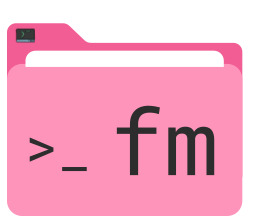
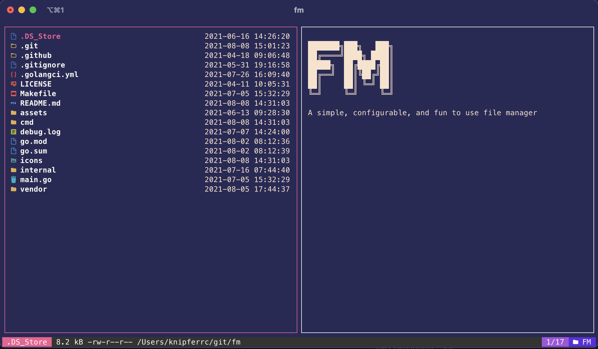

<p align="center">
  
  <p align="center">
    Keep those files organized
  </p>
</p>

<p align="center" style="margin-top: 30px; margin-bottom: 20px;">
  
</p>

## About The Project

A terminal based file manager

### Built With

- [Go](https://golang.org/)
- [bubbletea](https://github.com/charmbracelet/bubbletea)
- [bubbles](https://github.com/charmbracelet/bubbles)
- [lipgloss](https://github.com/charmbracelet/lipgloss)
- [Glamour](https://github.com/charmbracelet/glamour)

<br />

## Installation

```
go install github.com/knipferrc/fm@latest
```

## Usage

- Run `fm`
- Navigate your files with the following keys
  <br />

  - <kbd>h</kbd> or <kbd>left</kbd> Go back to the previous directory

  - <kbd>j</kbd> or <kbd>down</kbd> Move down in the file tree

  - <kbd>k</kbd> or <kbd>up</kbd> Move up in the file tree

  - <kbd>l</kbd> or <kbd>right</kbd> Opens the currently selected directory

  - <kbd>gg</kbd> Go to bottom of pane

  - <kbd>G</kbd> Go to top of pane

  - <kbd>~</kbd> Switch to home directory

  - <kbd>.</kbd> Toggle hidden files and directories

  - <kbd>-</kbd> Go to previous directory

  - <kbd>ctrl+c</kbd> Exit

  - <kbd>q</kbd> Exit if command bar not open

  - <kbd>:</kbd> Open command bar

    - `mkdir dirname` Create a new directory in the current directory

    - `touch filename.txt` Create new file in the current directory

    - `mv newname.txt`Rename currently selected file or directory

    - `cp /dir/to/move/to` Move currently selected file or directory

    - `rm` Delete the currently selected file or directory

  - <kbd>tab</kbd> Toggle between panes

  - <kbd>esc</kbd> Cancel any current action. Pressing <kbd>esc</kbd> during any action (rename, move, or delete) will cancel that action and return you to file navigation

- A config file will be generated at `.config/fm/config.yml` when you first run `fm`

<br />
<br />

### Default Config

```yml
colors:
  components:
    spinner: "#F25D94"
  dir_tree:
    selected_item: "#F25D94"
    unselected_item: "#FFFDF5"
  pane:
    active_border_color: "#F25D94"
    inactive_border_color: "#FFFDF5"
  status_bar:
    bar:
      background: "#353533"
      foreground: "#FFFDF5"
    logo:
      background: "#6124DF"
      foreground: "#FFFDF5"
    selected_file:
      background: "#F25D94"
      foreground: "#FFFDF5"
    total_files:
      background: "#A550DF"
      foreground: "#FFFDF5"
settings:
  pretty_markdown: true
  rounded_panes: false
  show_icons: true
  start_dir: .
```

<br />
<br />

## Local Development

Follow the instructions below to get setup for local development

1. Clone the repo

```sh
git clone https://github.com/knipferrc/fm
```

2. Run

```sh
make run
```

3. Build a binary

```sh
make build
```

<br />

### Credit

- Thank you to this repo https://github.com/Yash-Handa/logo-ls for the icons
